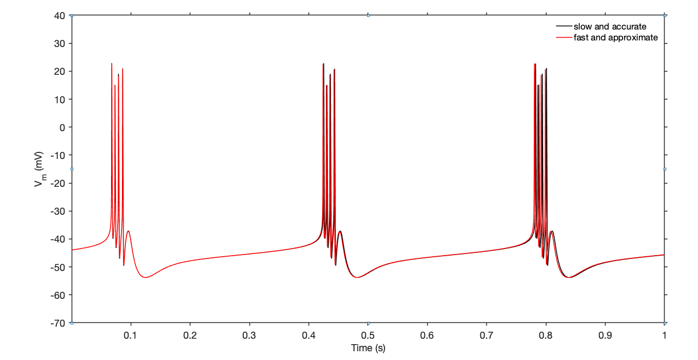

xolotl is designed to be as fast as possible. In our testing, it is the fastest simulator out there, and these tips will help you make your simulations run as fast as possible. 

We will use a single compartment bursting neuron and show what parameters increase or decrease speed of simulation. You can create this bursting neuron model using:

```
xolotl.go_to_examples
demo_bursting_neuron
```

## Measuring speed

We will measure speed as the ratio of the simulated time to the real time taken. Let's run our simulations for 20 seconds:

```
x.t_end = 20e3;
```

!!! Note "Hardware"
    We ran these numbers on a 2013 Apple MacBook, which is far from the fastest computer out there. Your experience may vary. 

Here's a one-liner that measures the speed of integration of this model:

```
tic; x.integrate; t = toc; (x.t_end*1e-3)/t

ans =

   59.8476
```

Out of the box, our model is running around `60X` real-time. Let's see what we can do to speed this up. 

## Strategies to increase speed

### Increase `sim_dt`

The simplest way to make your simulation run faster is to increase the `sim_dt`. Speed should be linear with `sim_dt`, as shown in this plot:


!!! warning 
     Remember that the accuracy of the simulation decreases with increasing `sim_dt`!

### Use approximations 


Many channels in xolotl can construct look-up tables (`LUT`s) for some functions. This can dramatically speed up your code, at the cost of accuracy. 

```
x.approx_channels = 1;
tic; x.integrate; t = toc; (x.t_end*1e-3)/t

ans =

  132.3989
```

Here, using approximations made the simulation run twice as fast. 


### Use simple solvers

The ODEs in this model can be solved using two different methods:

* The exponential Euler method, as described in the textbook by Dayan & Abbott
* The Runge-Kutta 4 method, which is general-purpose multi-step method

We see that the exponential Euler solver is more than 2 times faster than the Runge-Kutta solver for the same time step. 


```
x.approx_channels = 0;
x.solver_order = 0;
tic; x.integrate; t = toc; (x.t_end*1e-3)/t

ans =

   60.4497

x.approx_channels = 0;
x.solver_order = 4;
tic; x.integrate; t = toc; (x.t_end*1e-3)/t

ans =

   24.7365

```

### Use the simplest version of the model 

There are multiple versions of many components in xolotl. For example, there are temperature-sensitive versions of the channels we used here. If you don't need a feature, don't use it. 


### Don't create outputs


Skipping outputs technically makes the simulation run faster, but this effect is negligible. 


```
tic; [V, Ca, I] = x.integrate; t = toc; (x.t_end*1e-3)/t

ans =

   58.7266
```


### Turn off `closed_loop`

Turning off `closed_loop` can make things go a little faster, though in most cases this effect is negligible. When `closed_loop` is `false`, `cpplab.deserialize` is not called, so that's where the savings comes from. 

```
x.closed_loop = false;
tic; V = x.integrate; t = toc; (x.t_end*1e-3)/t

ans =

   61.5055
```

## Ludicrous mode

Combining these tips together, we can get some insanely fast speeds, at the cost of accuracy. You should inspect your model outputs and decide where the tradeoff between speed and quality lies for you. 

```
% slow but very accurate
x.approx_channels = 0;
x.solver_order = 4;
x.sim_dt = .05;
x.dt = .1;
tic; V1 = x.integrate; t = toc; (x.t_end*1e-3)/t

% fast but less accurate
x.approx_channels = 1;
x.solver_order = 0;
x.sim_dt = .1;
x.dt = .1;
tic; V2 = x.integrate; t = toc; (x.t_end*1e-3)/t

```

The slow-but-accurate simulation ran at `22X` while the fast simulation ran at around `340X`, or around **fifteen times faster**

Let's compare the outputs of the two simulations:



We see that the two traces are slightly different, but the overall features are the same. 


## Run code in parallel

A common task in simulations is a parameter sweep -- the same model is run for many different parameter sets. xolotl supports all features of parallelization built into MATLAB, making it easy for you to run your code in parallel. Look at [this page](https://xolotl.readthedocs.io/en/master/how-to/run-simulations-in-parallel/) for a primer on how to run your code in parallel. 

