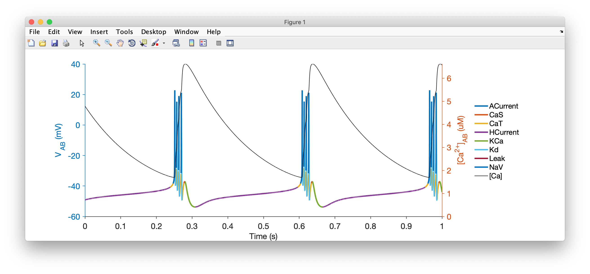

In this tutorial we will use the built-in demos in `xolotl` to see what
it can do, and to play with some models. We assume that you have installed
`xolotl` correctly, and have verified your installation. If you haven't
done that already, [click here and complete the steps on that page first](../tutorials/start-here.md).

### How to use the demos

First, let's go to the folder that contains the demos:

```matlab
xolotl.go_to_examples
```

Once there, you can run any of the scripts there to launch that demo. For example:

```matlab
demo_bursting_neuron
```

You should see this plot appear:



You can see what effect changing the maximal conductances has on the voltage dynamics by running:

```matlab
x.manipulate('*gbar')
```

This GUI will appear with sliders for maximal conductances of all the channels in the model. Try moving them around and seeing what happens with the voltage dynamics.


### Available demos

Xolotl comes with several example scripts that illustrate various features of the simulator. They're all in a folder called "examples", and you can jump into this folder from anywhere using `xolotl.go_to_examples`. Once there, run any one of these scripts by typing its name. 


| Demo name | What this demonstrates |
| --------- | ---------------------- |
| [demo_activation_functions](https://github.com/sg-s/xolotl/blob/master/examples/demo_activation_functions.m) | Using manipulate, this demo sets up a Hodgkin-Huxley model using generic conductances whose activation functions and timescales can be changed on the fly | 
| [demo_approx](https://github.com/sg-s/xolotl/blob/master/examples/demo_approx.m) | This example shows you how to use the [`appox_channels`](https://xolotl.readthedocs.io/en/master/reference/xolotl-properties/#approx_channels) property to speed up code execution |
| [demo_bursting_neuron](https://github.com/sg-s/xolotl/blob/master/examples/demo_bursting_neuron.m) | This example sets up a simple bursting neuron. It demonstrates how to use relational parameters to specify parameters that depend on other parameters in the model. |
| [demo_clamp](https://github.com/sg-s/xolotl/blob/master/examples/demo_clamp.m) | This example shows you how to voltage clamp a compartment, and simulate the process of estimating the I-V curve of a conductance |
| [demo_conductance](https://github.com/sg-s/xolotl/blob/master/examples/demo_conductance.m) | This script shows you how to use the conductance class to generate new C++ files for your own channels | 
| [demo_controlling_integration](https://github.com/sg-s/xolotl/blob/master/examples/demo_controlling_integration.m) | This example shows you how to use the [`output_type`](https://xolotl.readthedocs.io/en/master/reference/xolotl-properties/#output_type) property of xolotl to reduce memory use by finding spikes in the C++ code |
| [demo_integral_control](https://github.com/sg-s/xolotl/blob/master/examples/demo_integral_control.m) | This example shows you how to work with `mechanism` objects by adding homeostatic controllers to conductances and letting them tune the channel spectrum of a neuron | 
| [demo_manipulate](https://github.com/sg-s/xolotl/blob/master/examples/demo_manipulate.m) | This demo shows you how to use the [manipulate](https://xolotl.readthedocs.io/en/master/reference/xolotl-methods/#manipulate) method | 
| [demo_multi_compartment](https://github.com/sg-s/xolotl/blob/master/examples/demo_multi_compartment.m) | This example sets up a multi-compartment model, where different compartments have different levels of channels | 
| [demo_noise](https://github.com/sg-s/xolotl/blob/master/examples/demo_noise.m) | This example uses `mechanism` objects to introduce noise into a neuron simulation | 
| [demo_rk4](https://github.com/sg-s/xolotl/blob/master/examples/demo_rk4.m) | This demo shows you how to use the [`solver_order`](https://xolotl.readthedocs.io/en/master/reference/xolotl-properties/#solver_order) property of xolotl to use a Runge-Kutta 4 ODE solver to simulate the model| 
| [demo_stg](https://github.com/sg-s/xolotl/blob/master/examples/demo_stg.m) | In this example, we set up a small network of three neurons, demonstrating how synapses work in xolotl | 
| [demo_stg_temperature](https://github.com/sg-s/xolotl/blob/master/examples/demo_stg_temperature.m)  | Here, we vary the temperature of the simulation, showing how we can make the model sensitive to temperature. | 